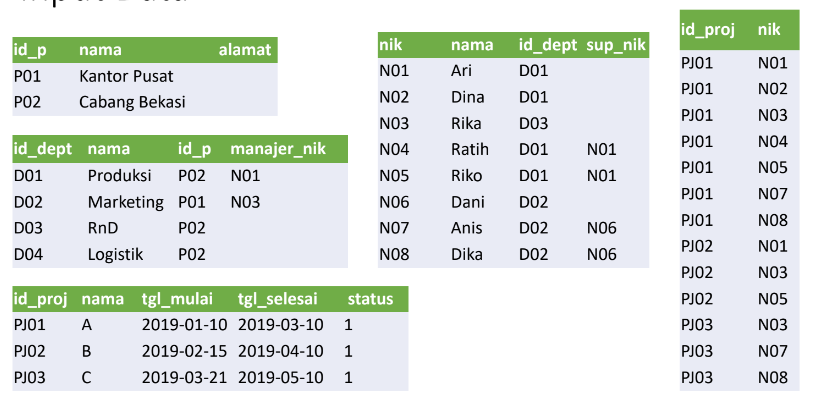

# Project UAS
 

 ## Profil
|  |  |
| -------- | --- |
| **Nama** | Muhammad Faiz Iqbal |
| **Kelas** | TI.23.A.5 |
| **Mata Kuliah** | Basis data |

## Data

***Query MySQL Pada Tabel Perusahaan***

```
CREATE TABLE Perusahaan(
id_p VARCHAR(10) PRIMARY KEY,
nama VARCHAR(45) NOT NULL,
alamat VARCHAR(45) DEFAULT NULL
);

INSERT INTO Perusahaan VALUES
('P01', 'Kantor Pusat', NULL),
('P02', 'Cabang Bekasi', NULL);
SELECT * FROM Perusahaan;
```

***Output :***


***Query MySQL Pada Tabel Departemen***

```
CREATE TABLE Departemen(
id_dept VARCHAR(10) PRIMARY KEY,
nama VARCHAR(45) NOT NULL,
id_p VARCHAR(10) NOT NULL,
manajer_nik VARCHAR(10) DEFAULT NULL
);

INSERT INTO Departemen VALUES
('D01', 'Produksi', 'P02', 'N01'),
('D02', 'Marketing', 'P01', 'N03'),
('D03', 'RnD', 'P02', NULL),
('D04', 'Logistik', 'P02', NULL);
SELECT * FROM Departemen;
```

***Output :***


***Query MySQL Pada Tabel Karyawan***

```
CREATE TABLE Karyawan(
nik VARCHAR(10) PRIMARY KEY,
nama VARCHAR(45) NOT NULL,
id_dept VARCHAR(10) NOT NULL,
sup_nik VARCHAR(10) DEFAULT NULL
);

INSERT INTO Karyawan VALUES
('N01', 'Ari', 'D01', NULL),
('N02', 'Dina', 'D01', NULL),
('N03', 'Rika', 'D03', NULL),
('N04', 'Ratih', 'D01', 'N01'),
('N05', 'Riko', 'D01', 'N01'),
('N06', 'Dani', 'D02', NULL),
('N07', 'Anis', 'D02', 'N06'),
('N08', 'Dika', 'D02', 'N06');
SELECT * FROM Karyawan;
```

***Output :***


***Query MySQL Pada Tabel Project***

```
CREATE TABLE Project(
id_proj VARCHAR(10) PRIMARY KEY,
nama VARCHAR(45) NOT NULL,
tgl_mulai DATETIME,
tgl_selesai DATETIME,
status TINYINT(1)
);

INSERT INTO Project VALUES
('PJ01', 'A', '2019-01-10', '2019-03-10', '1'),
('PJ02', 'B', '2019-02-15', '2019-04-10', '1'),
('PJ03', 'C', '2019-03-21', '2019-05-10', '1');
SELECT * FROM Project;
```

***Output :***


***Query MySQL Pada Tabel Project Deatil***

```
CREATE TABLE Project_detail(
id_proj VARCHAR(10) NOT NULL,
nik VARCHAR(10) NOT NULL
);

INSERT INTO Project_detail VALUES
('PJ01', 'N01'),
('PJ01', 'N02'),
('PJ01', 'N03'),
('PJ01', 'N04'),
('PJ01', 'N05'),
('PJ01', 'N07'),
('PJ01', 'N08'),
('PJ02', 'N01'),
('PJ02', 'N03'),
('PJ02', 'N05'),
('PJ03', 'N03'),
('PJ03', 'N07'),
('PJ03', 'N08');
SELECT * FROM Project_detail;
```

***Output :***


## Soal
## Berdasarkan ERD dan Sampel Data diatas buatla Query SQL untuk:
### 1. Menampilkan Nama Karyawan yang Berada di Departemen yang Dipimpin oleh Manajer dengan Nama 'Rika'
**Script :**

```
SELECT nik, nama, id_dept
FROM karyawan
WHERE id_dept = (SELECT id_dept FROM departemen WHERE manajer_nik = 'N03');
```

**Output :**


### 2. Menampilkan Nama Proyek yang dikerjakan oleh Karyawan dari Departemen 'RnD'
**Script :**

```
SELECT project.nama AS 'Nama Project'
From Project
INNER JOIN project_detail ON project.id_proj = project_detail.id_proj
INNER JOIN Karyawan ON karyawan.nik = project_detail.nik
INNER JOIN Departemen ON karyawan.id_dept = Departemen.id_dept
WHERE Departemen.nama = 'RnD';
```

**Output :**


### 3. Menampilkan Nama Karyawan yang Terlibat dalam Lebih dari Satu Proyek
**Script :**

```
SELECT Karyawan.nama AS 'Nama Karyawan'
FROM project_detail
INNER JOIN Karyawan ON Project_detail.nik = Karyawan.nik
GROUP BY Karyawan.nama
HAVING COUNT(Project_detail.id_proj) > 1;
```

**Output :**


### 4. Menampilkan Nama Proyek yang melibatkan Karyawan terbanyak.
**Script :**

```
SELECT Project.nama AS 'Nama Proyek', COUNT(Project_detail.nik) AS 'Jumlah Karyawan'
FROM Project
INNER JOIN Project_detail ON Project.id_proj = Project_detail.id_proj
GROUP BY Project.nama
ORDER BY COUNT(Project_detail.nik) DESC
LIMIT 1;
```

**Output :**


### 5. Menampilkan Nama Proyek yang Diikuti oleh Karyawan dengan Gaji Pokok Kurang dari 3 Juta
**Script :**

```
SELECT DISTINCT Project.nama AS 'Nama Proyek'
FROM Project
INNER JOIN Project_detail ON Project.id_proj = Project_detail.id_proj
INNER JOIN Karyawan ON Project_detail.nik = Karyawan.nik
WHERE Karyawan.gaji_pokok < 3000000;
```

**Output :**


## TERIMAKASIH

